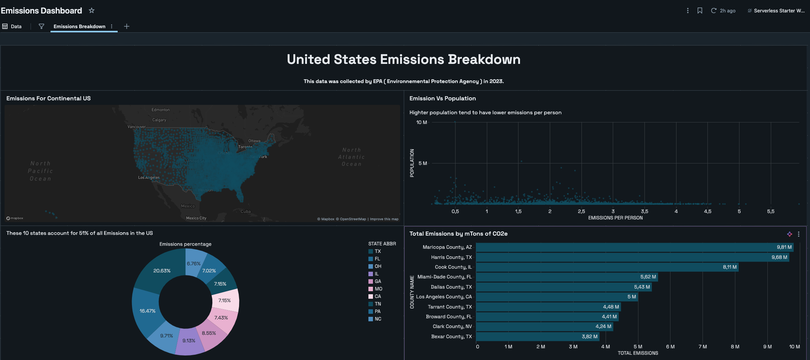
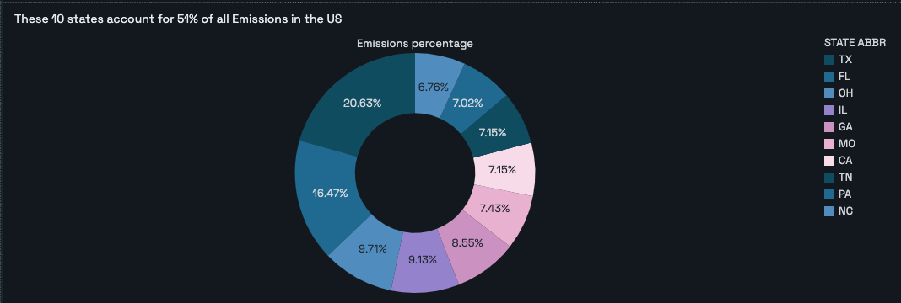

# 🇺🇸 US Emissions Breakdown — Databricks Dashboard

My first Databricks project: analysis and visualization of greenhouse gas (GHG) emissions across the United States at the county level, using data from the **EPA (Environmental Protection Agency)** collected in 2023.

## 📊 Dashboard Overview



The dashboard cross-references total emissions with population by county, highlighting the relationship between population density and per-capita emissions.



**Key insight:** the top 10 emitting states (TX, FL, OH, IL, GA, MO, CA, TN, PA, NC) alone account for **51% of total emissions nationwide**, with Texas leading at 20.6%. At the county level, Maricopa County (AZ) and Harris County (TX) are the top emitters, each at nearly 9.7–9.8 million tons of CO2e.

## 🎯 Project Goals

- Explore a county-level emissions dataset (3,143 U.S. counties) using SQL
- Write SQL queries to aggregate and rank emissions by state and county
- Build exploratory visualizations (map, scatter plot, pie chart, ranking)

## 🗂️ Data

The [`Emissions_Data_2023.csv`](Emissions_Data_2023.csv) file contains, per county:
- Geographic information (state, county, coordinates)
- Population and employment
- Energy consumption (electricity, natural gas) in MWh / TcF, per capita
- GHG emissions in metric tons of CO2e
- Fuel consumption and vehicle miles traveled
- Number of buildings and area

**Source:** U.S. Environmental Protection Agency (EPA), 2023

## 🛠️ Tech Stack

- **Databricks SQL** — queries to explore and aggregate the data
- **Databricks Dashboards (Lakeview)** — for visualization

## 📁 Repo Structure

```
.
├── README.md
├── Emissions_Data_2023.csv
└── images/
    ├── dashboard_overview.png
    └── dashboard_top_counties.png
```

## 💡 What I Learned

- Getting hands-on with the Databricks environment (notebooks, clusters, dashboards)
- Building geospatial and statistical visualizations from raw data
